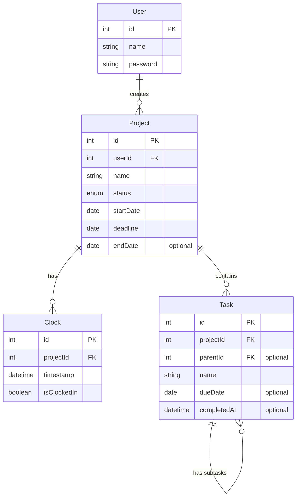

# FreelanceIT

## Introduction

FreelanceIT is a project management software designed specifically for freelancers to efficiently manage their projects and track task durations. It streamlines workflow and provides insights into productivity, helping freelancers stay organized and on top of deadlines. ​

## Storyboard

## Requirements

1. As a Freelancer, I want to be able to keep track of all my projects, so that I can know which one is already completed.
   
**Given**: A freelancer has multiple ongoing projects

**When**: They log into FreelanceIT and navigate to the project dashboard

**Then**: They can see a centralized list of all their current projects with relevant details like deadlines and progress status.

2. As a Freelancer, I want know how long I spent on each project, So that I can manage my time effectively.
   
**Given**: A freelancer is working on a specific task within a project

**When**: They log the start and end time for each task

**Then**: They receive a total time summary for all tasks completed that day.

3. As a freelancer, I want to create a prioritized to-do list so that I can focus on completing my most important tasks first.
   
**Given**: A freelancer has tasks to complete

**When**: They create a to-do list

**Then**: They can see their tasks sorted by priority

## Class Diagram

## Class Diagram Description

## JSON Schema

## Team Members and Roles

**Scrum Master**​: Jasmine Lim Smith

**Developer**:​ Nivedha Balasubramanian

**Developer**​: Somyani Ghimire

**UI Specialist**: Vinay Thamara

## Milestones

