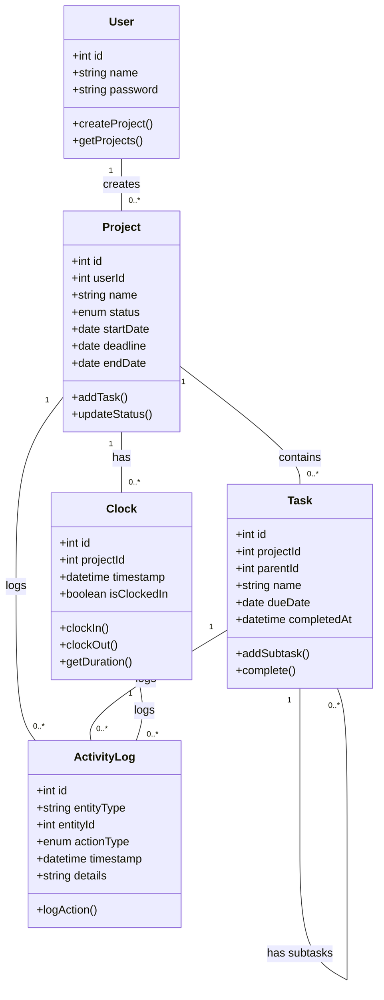

# FreelanceIT

## How to Start the Project
1. Install [Docker Desktop](https://www.docker.com)
2. In the project directory run
``` 
docker compose up 
```
  - This will set up the docker container, and run it with the database so that the program runs
  - Currently there aren't any databases actually used, but we used it for future setups.
3. If using IntelliJ Idea you should be able to run the project using the default configuration and press play on the top right corner
4. Navigate to [localhost:8080](http://localhost:8080/)
5. If you have any troubles or questions message any one of us on teams.

## Introduction

FreelanceIT is a project management software designed specifically for freelancers to efficiently manage their projects and track task durations. It streamlines workflow and provides insights into productivity, helping freelancers stay organized and on top of deadlines. ​

## Storyboard - [Link to Figma](https://www.figma.com/proto/6UlcJ96ng53zBShCTZDhuR/Untitled?node-id=1-2&node-type=canvas&t=IHGQ6s4PftIiCHXR-0&scaling=contain&content-scaling=fixed&page-id=0%3A1)
### Login

### Homepage

### Add Project Page

### Task Page

### Tasks


## Requirements

1. As a Freelancer, I want to be able to keep track of all my projects, so that I can know which one is already completed.
   
**Given**: A freelancer has multiple ongoing projects

**When**: They log into FreelanceIT and navigate to the project dashboard

**Then**: They can see a centralized list of all their current projects with relevant details like deadlines and progress status.

2. As a Freelancer, I want know how long I spent on each project, So that I can manage my time effectively.
   
**Given**: A freelancer is working on a specific task within a project

**When**: They log the start and end time for each task

**Then**: They receive a total time summary for all tasks completed that day.

3. As a freelancer, I want to create a prioritized to-do list so that I can focus on completing my most important tasks first.
   
**Given**: A freelancer has tasks to complete

**When**: They create a to-do list

**Then**: They can see their tasks sorted by priority

## Class Diagram


## Class Diagram Description
**User**: Manages user accoutnts and Project Ownership

**Project**: Represents a project and its lifecycle

**Clock**: Tracks time spent on projects

**Task**: Manages individual tasks within projects

## JSON Schema
```json
{
  "type": "object",
  "properties": {
    "id": {
      "type": "integer"
    },
    "name": {
      "type": "string"
    },
    "projects": {
      "type": "array",
      "items": {
        "type": "object",
        "properties": {
          "id": {
            "type": "integer"
          },
          "name": {
            "type": "string"
          },
          "status": {
            "type": "string",
            "enum": ["NOT_STARTED", "IN_PROGRESS", "COMPLETED", "ON_HOLD"]
          },
          "startDate": {
            "type": "string",
            "format": "date"
          },
          "deadline": {
            "type": "string",
            "format": "date"
          },
          "endDate": {
            "type": "string",
            "format": "date"
          },
          "tasks": {
            "type": "array",
            "items": {
              "type": "object",
              "properties": {
                "id": {
                  "type": "integer"
                },
                "name": {
                  "type": "string"
                },
                "dueDate": {
                  "type": "string",
                  "format": "date"
                },
                "completedAt": {
                  "type": "string",
                  "format": "date-time"
                },
                "subtasks": {
                  "type": "array",
                  "items": {
                    "$ref": "#/properties/projects/items/properties/tasks/items"
                  }
                }
              },
              "required": ["id", "name"]
            }
          },
          "clockEntries": {
            "type": "array",
            "items": {
              "type": "object",
              "properties": {
                "id": {
                  "type": "integer"
                },
                "timestamp": {
                  "type": "string",
                  "format": "date-time"
                },
                "isClockedIn": {
                  "type": "boolean"
                }
              },
              "required": ["id", "timestamp", "isClockedIn"]
            }
          }
        },
        "required": ["id", "name", "status", "startDate", "deadline"]
      }
    }
  },
  "required": ["id", "name", "projects"]
}
```

## Team Members and Roles

**Scrum Master**​: Jasmine Lim Smith

**Developer**:​ Nivedha Balasubramanian

**Developer**​: Somyani Ghimire

**UI Specialist**: Vinay Thamara

## Milestones
[Milestone 1](https://github.com/FreelanceIT-IT4045C002/FreelanceIT/milestone/1) <br />
[Milestone 2](https://github.com/FreelanceIT-IT4045C002/FreelanceIT/milestone/2) <br />
[Milestone 3](https://github.com/FreelanceIT-IT4045C002/FreelanceIT/milestone/3)

